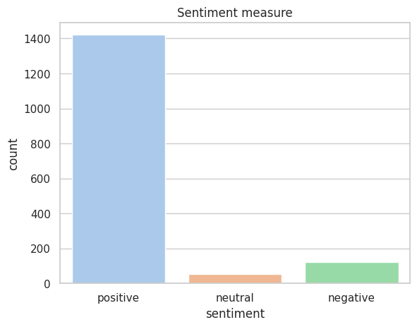
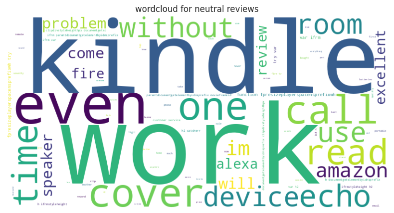
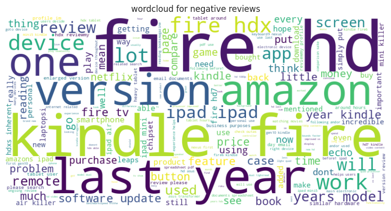
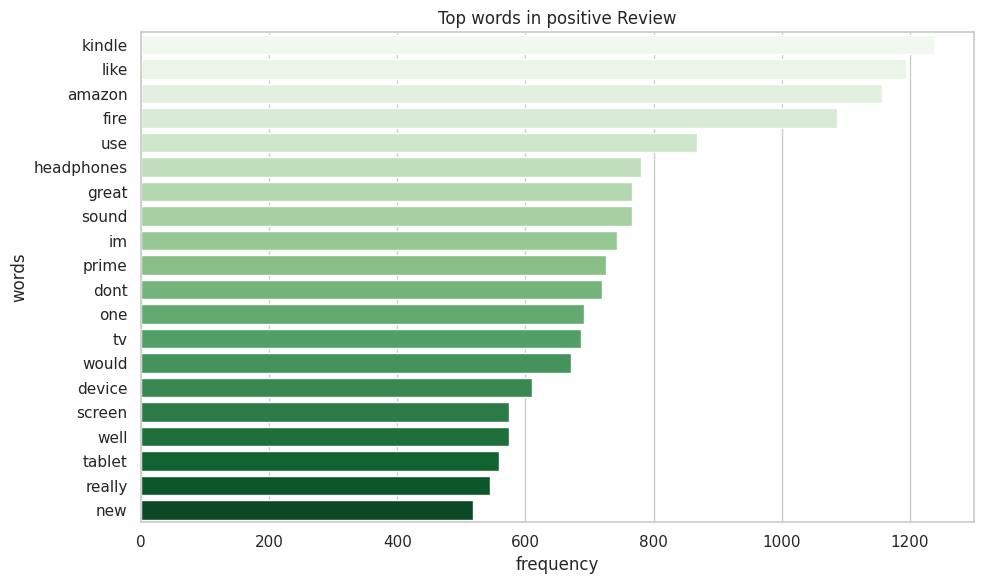
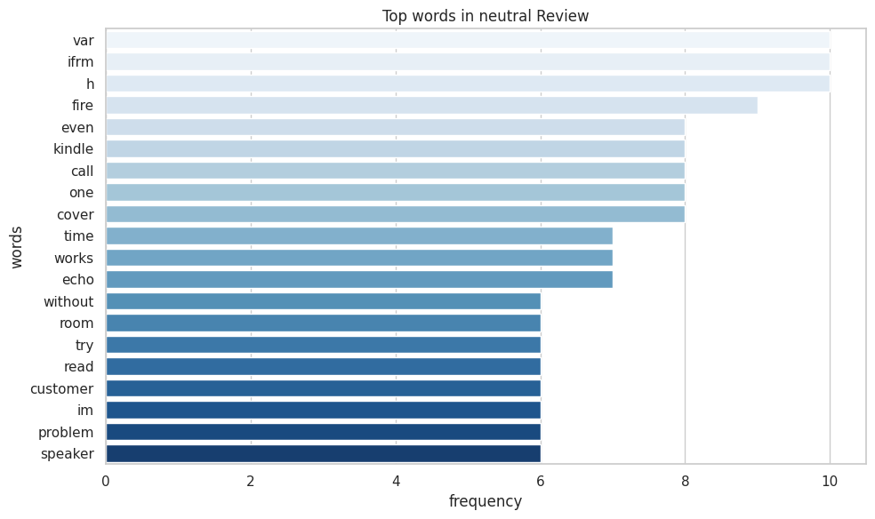
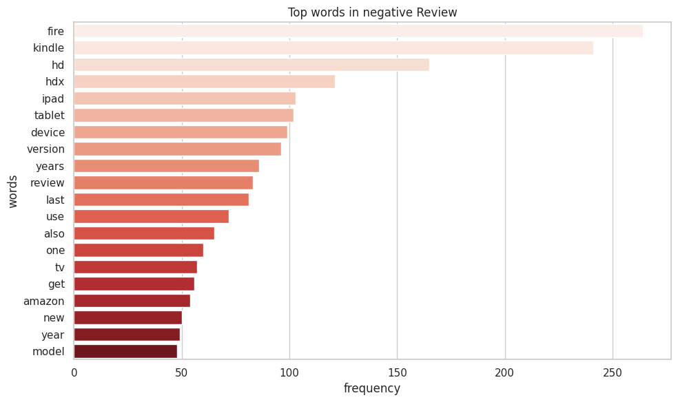

# 📊 Amazon Product Reviews – Sentiment & Topic Analysis

## 📌 Project Overview
Amazon receives a massive volume of customer reviews across its products.  
Manually analyzing this feedback is not scalable.

This project applies **Natural Language Processing (NLP)** and **sentiment analysis** techniques to classify Amazon product reviews into **positive, neutral, and negative sentiments**, and to uncover the **key topics and drivers** behind customer opinions.

---

## 🎯 Business Objective
- Automatically analyze customer sentiment from text reviews  
- Identify common themes in positive, neutral, and negative feedback  
- Generate actionable insights to support **product improvement, pricing strategy, and customer experience**

---

## 📁 Dataset
- Amazon Product Reviews dataset  
- Primary column used: `reviews.text`  
- Missing values were removed before analysis  

---

## 🧹 Text Preprocessing
- Lowercased text  
- Removed URLs, mentions, and punctuation  
- Tokenized text using **NLTK**  
- Removed stopwords  

---

## 😊 Sentiment Analysis
- Tool used: **VADER Sentiment Analyzer**  
- Metric: `compound` score  
- Classification:
  - **Positive:** score ≥ 0.05  
  - **Negative:** score ≤ -0.05  
  - **Neutral:** otherwise  

---

## 📊 Sentiment Distribution

**Insight:**  
- Most reviews are positive  
- Neutral and negative reviews form a smaller proportion  
- Indicates overall customer satisfaction  

---

## ☁️ Word Cloud Analysis

### Positive Reviews

### Neutral Reviews

### Negative Reviews

---

## 🔑 Keyword Frequency Analysis

### Top 20 Words – Positive Reviews

### Top 20 Words – Neutral Reviews

### Top 20 Words – Negative Reviews

---

## 📌 Business Insights

### 🟥 Negative Reviews
- Device issues: *screen*, *button*, *remote*  
- Specific products: *Kindle*, *Fire*, *HDX*  
- Price comparisons (*iPad*)  

**Action:** Improve usability and reconsider pricing/features

### 🟦 Neutral Reviews
- Mostly factual language, minor issues  

**Action:** Reduce small friction points

### 🟩 Positive Reviews
- Ease of use and features highlighted (*amazon*, *love*, *alexa*)  

**Action:** Leverage strengths in marketing/retention

---

## 🛠 Tools & Libraries
Python, Pandas, NumPy, NLTK, VADER Sentiment, Matplotlib, Seaborn, WordCloud  

---

## 🚀 Conclusion
NLP techniques can transform unstructured reviews into **business insights**, identifying drivers of satisfaction and dissatisfaction.

---

